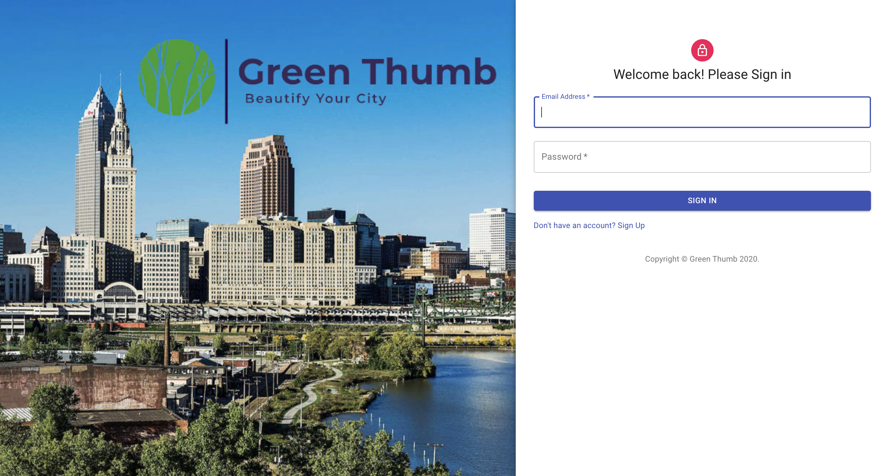
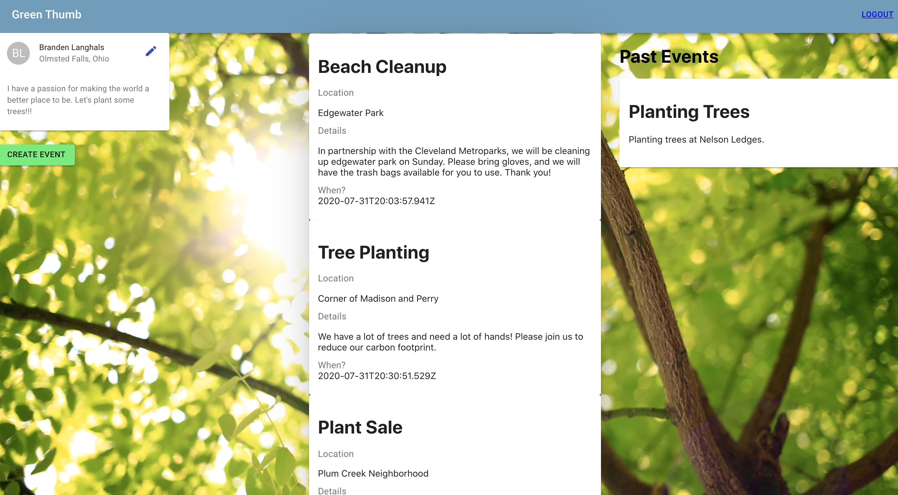

# Green Thumb

Green Thumb is a simple platform for users to find and create events targeted at making communities cleaner, and offsetting our carbon footprint. Users can create and edit a profile, then find an event to participate in, or create an event for others to join.  
###Landing Page

###Login

###Main Page


## Installing

To run the app locally, you will first need to git clone the repository to your local machine. 

HTTPS:
````
$ git clone https://github.com/Brandenlanghals/greenthumb.git
````
SSH:
````
$ git clone git@github.com:Brandenlanghals/greenthumb.git
````

Once cloned, cd into the repository and install the necessary dependencies by running:
````
$ npm install
````

You can then start the app locally by running: 
````
$ npm run start
````

## Built With
* [MongoDB](https://www.mongodb.com/) - Database
* [Express.js](https://expressjs.com/) - Node.js framework
* [React](https://reactjs.org/) - Javascript Interface 
* [Node.js](https://nodejs.org/en/) - JavaScript runtime
* [jQuery](https://jquery.com/) - Front-end framework
* [Passport](http://www.passportjs.org/) - Authentication for Node.js
* [npm](https://www.npmjs.com/) - Dependency management
* [Material-UI](https://material-ui.com/) - CSS framework

## Authors
See contribution history [here](https://github.com/Brandenlanghals/greenthumb/graphs/contributors)

## Future Updates
Making the app a mobile app is the biggest priority. This would allow events to be found or created on-the-go, and also allow you to help out wherever you may be. 
We would also like to build out the profiles functionality to make connections and enable group collaboration between users. Also, we would like to add a geolocation feature to only display events in your area. 
